# ReUI

ReUI is a project that combines all UI mods into one - an overhaul of whole UI of Supreme Commander: Forged Alliance. Here is current list of mods and libraries that are part of ReUI project.
[Project Discord server](https://discord.gg/UZeAEXHV).

## Mods

### ReUI.Score

Previously "4z0t's scoreboard". As originally it is completely rewamped scoreboard panel with various new features and fixes.

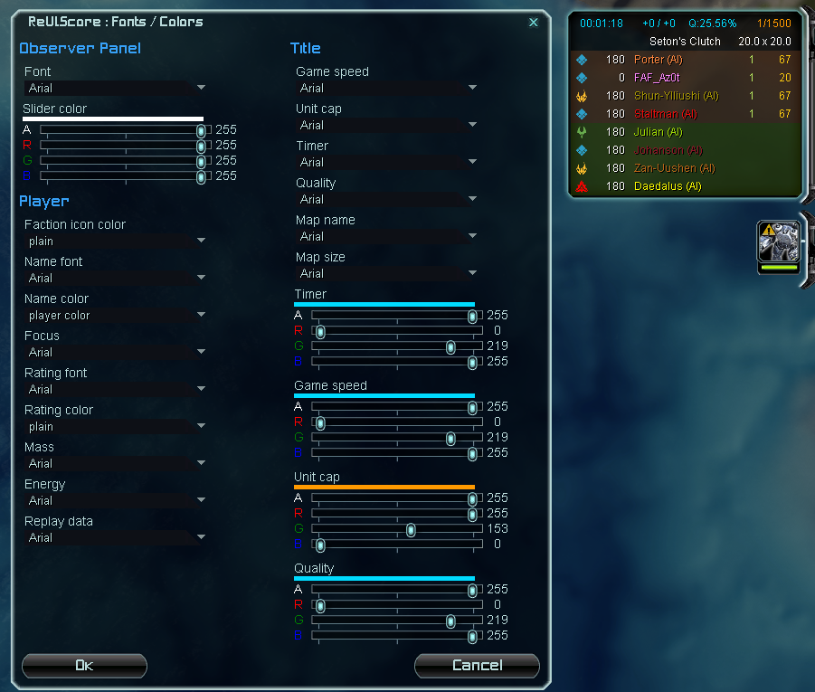
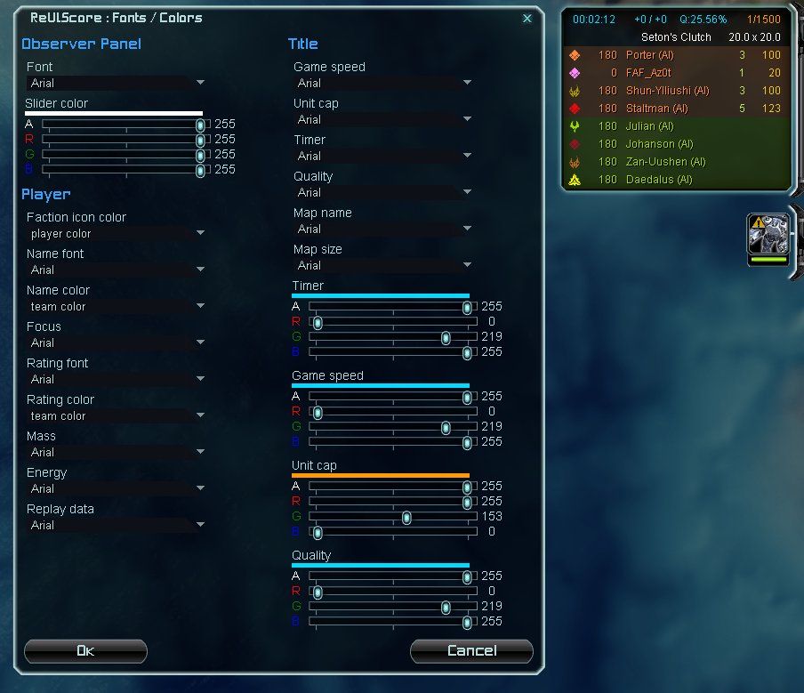

[More about scoreboard](./Deprecated/4SB/README.md).

### ReUI.Economy

It is simply updated panel of economy with scale and custom layout capabilities.

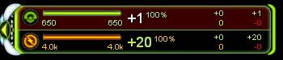

#### Middle layout

Mod "EconomyMiddle" allows you to select middle layout for economy panel.

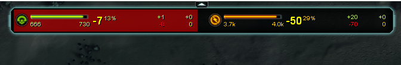

### ReUI.Reclaim

Previously "EzReclaim" and "Optimized reclaim view". It provides with better looking reclaim labels and also shows them in reclaim command mode.

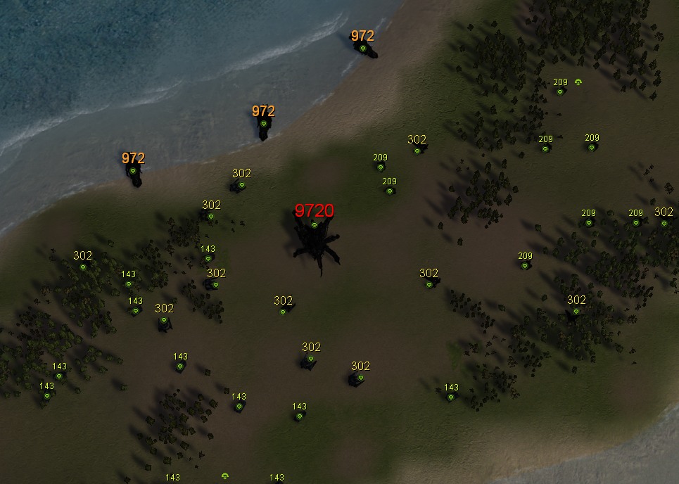

There are several options that can be adjusted for your needs and hardware
* **max labels**: maximum number of reclaim labels that can be shown at the same time
* **zoom threshold**: minimum zoom level at which reclaim labels will start to batch together
* **grouping distance**: radius at which reclaim labels will be grouped together
* **update rate**: delay in ms between updates of reclaim labels

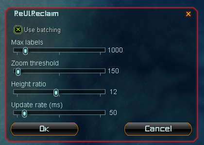

### ReUI.Construction

ReUI.Construction is complete overhaul of original construction panel. Optimized, extendable and improved with new features over original one.
Currently it is missing some of the features of original panel, such as templates, but it will be added in future.

Improvements over original construction panel:

* can be scaled
* order of units in selection is deterministic and is sorted in this order: engineers -> Land units -> Air units -> Naval units -> Structures and everything else
* queue drag is more stable and also works for mobile factories

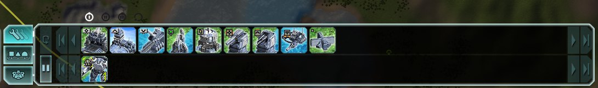
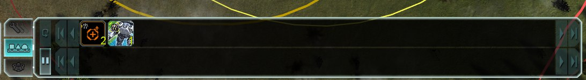
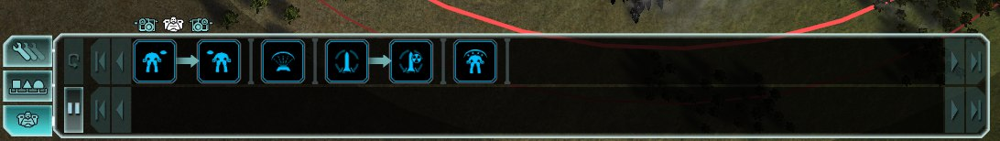
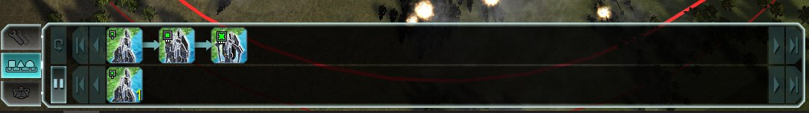

### ReUI.Hotbuild

Previously "HotBuild Overhaul". Currently it is slightly improved HotBuild Overhaul mod. But in addition it allows you to use templates in building sets.

Template items are highlighted with yellow color. **Fill** button will convert template for all factions.

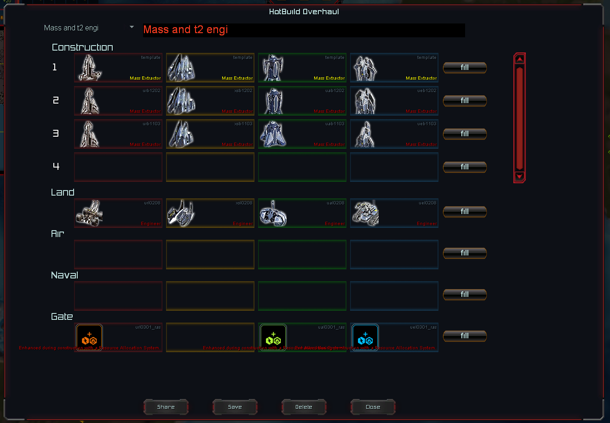

ReUI.Hotbuild changes default mechanism of hotbuild and fixes previously addressed [issue](#69) with it. Since now on factory sets are picking only ***one*** item, you can't have multiple items for a factory as it was before.

### ReUI.Minimap

Adds option to lock zoom and automatically adjusts minimap size to map size.

### ReUI.ActionsPanel

Previously "Actions Grid Panel".

## Libraries

### ReUI.Core

Core library of ReUI. Provides functions for hooking into existing files of the game and executing code before and after UI is created. And functions for creating classes with properties and tables with weak keys/values.

### ReUI.Options

Module with functions to create and manage options for your mod. It provides with `OptionVar` class to create reactive options for your needs; builder to create options menus with various types of options: filters, scrollers, selectors and etc. Use cases can be found in almost every mod in `Options.lua`.

### ReUI.UI

Provides with 3 crucial classes for ReUI's controls: Layouter, Layout and Layoutable.

Layouter is responsoble for performing layout on a given control. Supports reactive scaling. Each control by default uses parent's layouter.
Layout is a class that represents layout of given control and can switched on the fly to alter control's layout. By default each control uses layout that is done inside `InitLayout` method.
Layoutable is a class that stores Layouter and Layout references and applies them when needed. You can inherit this class to use Layouter and Layout in your control.

#### ReUI.UI.Controls

Provides with primitive classes that inherit Layoutable class. These are Group, Text, Bitmap and CheckBox (no idea why this one is here :D).

#### ReUI.UI.Views

Provides with generic controls such as button, arrow, border, bracket, scrollable control and grid.

#### ReUI.UI.Animation

#### ReUI.UI.Color

### ReUI.LINQ

An icing on cake. A [.Net LINQ inspired library](https://github.com/4z0t/LuaLINQ) adapted for FAF needs and environment. This is superior version of LINQ (LuaQ) from deprecated UI mod tools. Way faster and more flexible. Basically it is a collection of functions to manipulate collections in efficient, easy to read and extend way.

### ReUI.WorldView

Extends original WorldView with ECS. Applications can be seen in **[ReUI.Reclaim](#reuireclaim)** and **RFA**.
