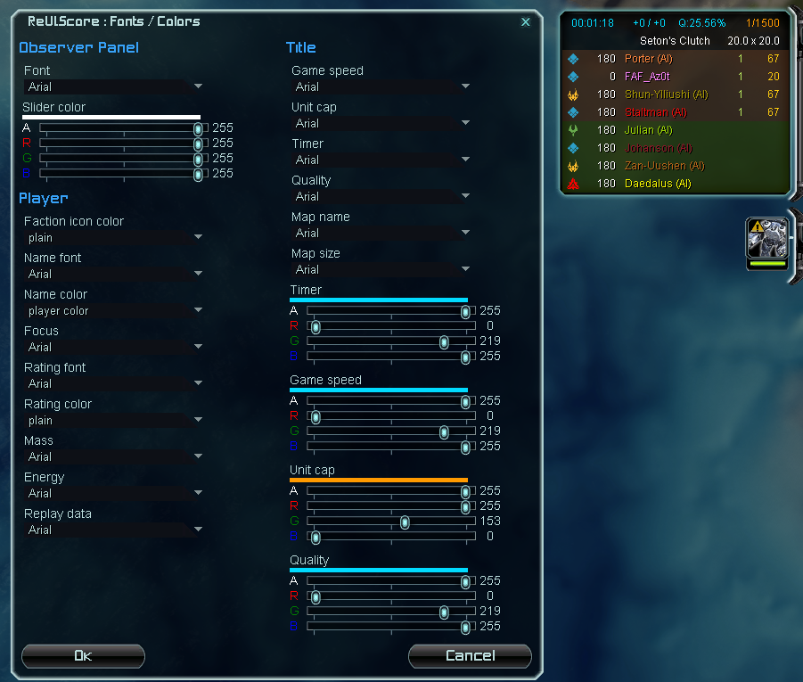
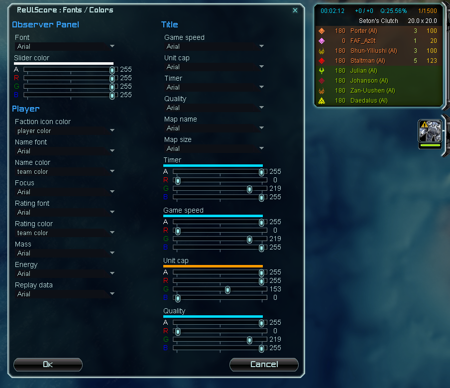
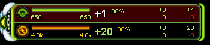
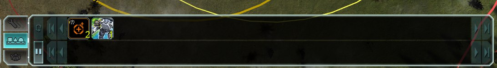

# ReUI
ReUI is a project that combines all UI mods into one - an overhaul of whole UI of Supreme Commander: Forged Alliance. Here is current list of mods and libraries that are part of ReUI project.

## Mods

### ReUI.Score
Previously "4z0t's scoreboard". As originally it is completely rewamped scoreboard panel with various new features and fixes.

Mode about scoreboard [here](./Deprecated/4SB/README.md).

### ReUI.Economy
It is simply updated panel of economy with scale and custom layout capabilities.

#### Middle layout
Mod "EconomyMiddle" allows you to select middle layout for economy panel.

### ReUI.Reclaim
Previously "EzReclaim" and "Optimized reclaim view". It provides with better looking reclaim labels and also shows them in reclaim command mode.

### ReUI.Construction
ReUI.Construction is complete overhaul of original construction panel. Optimized, extendable and improved with new features over original one.
Currently it is missing some of the features of original panel, such as templates, but it will be added in future.

Improvements over original construction panel:
* can be scaled
* order of units in selection is deterministic and is sorted in this order: engineers -> Land units -> Air units -> Naval units -> Structures and everything else
* queue drag is more stable and also works for mobile factories

## Libraries

### ReUI.Core
Core library of ReUI. Provides functions for hooking into existing files of the game and executing code before and after UI is created. And functions for creating classes with properties and tables with weak keys/values.

### ReUI.Options
Module with functions to create and manage options for your mod. It provides with `OptionVar` class to create reactive options for your needs; builder to create options menus with various types of options: filters, scrollers, selectors and etc. Use cases can be found in almost every mod in `Options.lua`.

### ReUI.UI
#### ReUI.UI.Controls
#### ReUI.UI.Views
#### ReUI.UI.Animation
#### ReUI.UI.Color
### ReUI.LINQ
An icing on cake. A [.Net LINQ inspired library](https://github.com/4z0t/LuaLINQ) adapted for FAF needs and environment. This is superior version of LINQ (LuaQ) from deprecated UI mod tools. Way faster and more flexible. Basically it is a collection of functions to manipulate collections in effictient, easy to read and extend way. 
