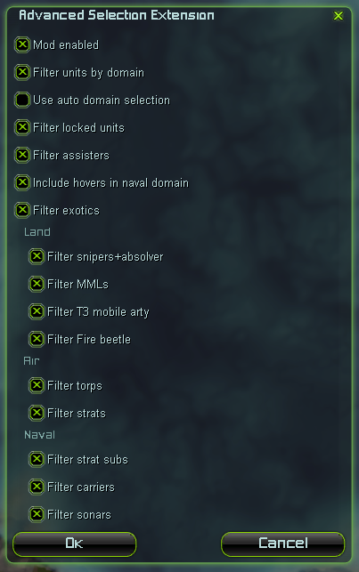

# Advanced Selection Extension

This mod is superior version of old Selection Deprioritizer. ASE provides with more features and more stable and performant compared to predecessor.

## Options

With options menu you can enable and disable certain functions in real time.

Lets go through each one of them to see what they do.

### Domain filters

You can select what domain to prioritize during game. To do that you need to bind a key for `Rotate Domain order`. Rotating domain orders makes them be prioritized above others and the order is show with a message and with cursor label. 

*You can also use auto one, but it is an experimental feature and requires some time to get used to.*

### Unit lock

You can lock units from selecting with others. Only locked units can be selected together or with shift pressed. Bind `Toggle units lock` to use the feature.

### Assister filter

Some units are crucial to be near others. Mobile shields, land scouts and stealth fields won't be selected if they are guarding any other unit.

### Hovers and Naval

Hovers are helpful during naval combat, but they are considered as Land domain units. You can enable that hovers will be selected with naval units.

### Exotics

Most units must stay behind others and should not be selected in first place. With that feature you can forget about long ranged units going in with rest of others during fights.

## Compatibility

Mod may be incompatible with other mods that alter selection and somehow use it. Definitely incompatible Selection Deprioritizer.

Requires UI Mod Tools to function.
